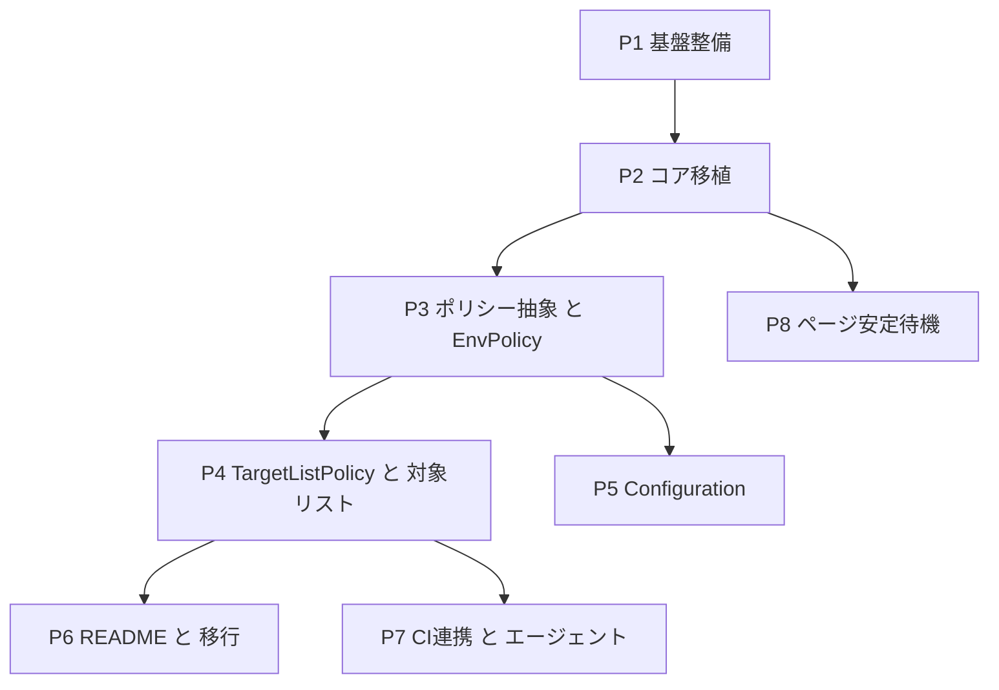

# capybara-storyboard 実装フェーズ索引

このディレクトリには capybara-storyboard gem の実装計画を置く。役割分担は次のとおり:

- [overview.md](overview.md) — **設計仕様の single source of truth（SSOT）**。「何を作るか」をフェーズに依存しない形で定義する。
- 本 README と各 `phase-N-*.md` — **実装計画（フェーズ索引と各フェーズの詳細）**。「どの順でどう作るか」を定義する。仕様の再定義はせず、overview.md の該当節（§番号）を参照する。

各フェーズドキュメントを読む前に、必ず [overview.md](overview.md) を先に読むこと。

---

## フェーズ一覧

| # | タイトル | 要約 | 依存 |
|---|---|---|---|
| [P1](phase-1-foundation.md) | 基盤整備（Phase 0 残タスク） | gemspec メタデータ確定・capybara 依存追加・sgcop 導入・CI Ruby バージョン修正・README/CHANGELOG 骨実質化 | なし |
| [P2](phase-2-core-port.md) | コア移植（挙動パリティ） | gist concern を TestHelper に移植。手動 screenshot・連番・出力先・サニタイズ・全アクションオーバーライド。判定は単一ブール | P1 |
| [P3](phase-3-policy-env.md) | ポリシー抽象 + EnvPolicy | 判定をポリシーオブジェクト経由に。Context 値オブジェクト導入、per-test 一度だけ評価しキャッシュ。デフォルト = EnvPolicy | P2 |
| [P4](phase-4-target-list.md) | TargetListPolicy + 対象リスト受け取り | パスベース TargetListPolicy、SCREENSHOT_TESTS_FILE/SCREENSHOT_TESTS 読込、パス正規化、Env AND TargetList 合成 | P3 |
| [P5](phase-5-configuration.md) | Configuration | configure で output_dir とポリシー上書き | P3（P4 と並行可） |
| [P6](phase-6-docs-readme.md) | ドキュメント: README + 移行手順 | README（導入・有効化モデル・前提と割り切り・gist 移行） | P4 |
| [P7](phase-7-docs-ci-agent.md) | ドキュメント: CI 連携 + エージェント | docs/github-actions.md + docs/agent-workflow.md | P4（P6 と並行可） |
| [P8](phase-8-page-stability-wait.md) | ページ安定待機（実装完了） | `document.getAnimations()` + `MutationObserver` によるポーリングで撮影直前のページ安定を待つ機構を実装。パラメータ（間隔 0.5秒・試行回数10回・除外アニメ名空リスト・タイムアウト時は warn ログのみ）を確定済み。手動スクショの意味論も enabled ガード付きに改訂済み | P2 |

---

## 依存グラフ

- **クリティカルパス**: P1 → P2 → P3 → P4 → docs（P6/P7）。
- **並行可能**: P5 と P4 は P3 完了後に並行して進められる。P6 と P7 は P4 完了後に並行して進められる。P8 は P2 完了後、他フェーズと並行して進められる（パラメータの `configure` 反映のみ P5 と協調）。

---

## 各フェーズドキュメントへのリンク

- [phase-1-foundation.md](phase-1-foundation.md) — P1 基盤整備（Phase 0 残タスク）
- [phase-2-core-port.md](phase-2-core-port.md) — P2 コア移植（挙動パリティ）
- [phase-3-policy-env.md](phase-3-policy-env.md) — P3 ポリシー抽象 + EnvPolicy
- [phase-4-target-list.md](phase-4-target-list.md) — P4 TargetListPolicy + 対象リスト受け取り
- [phase-5-configuration.md](phase-5-configuration.md) — P5 Configuration
- [phase-6-docs-readme.md](phase-6-docs-readme.md) — P6 ドキュメント: README + 移行手順
- [phase-7-docs-ci-agent.md](phase-7-docs-ci-agent.md) — P7 ドキュメント: CI 連携 + エージェント
- [phase-8-page-stability-wait.md](phase-8-page-stability-wait.md) — P8 ページ安定待機

---

## 共通テンプレート（各フェーズドキュメントの節構成）

各 `phase-N-*.md` は以下の節構成に統一する:

1. **目的** — 達成する価値を1〜3行 + overview.md の対応節（§番号）へのリンク。
2. **スコープ** — 含むもの / 含まないもの（Non-goals）。
3. **前提・依存** — 先行フェーズ / 並行可能フェーズ / 外部前提。
4. **実装方針** — 責務配置・設計判断の要点（コードは書かない。どのクラス/モジュールに何の責務を置くかのみ記述）。
5. **変更ファイル** — 新規 / 変更 / テスト（RSpec） / ドキュメント（具体的なパスを列挙）。
6. **受け入れ条件** — checklist 形式。「CI（spec + sgcop/rubocop）が緑」を全フェーズ共通で含む。
7. **テスト観点** — 単体/結合の切り分け・網羅すべきエッジケース。
8. **リスク・決定事項** — このフェーズで確定させる overview.md §11 の決定事項（該当フェーズのみ内容を持つ）。
9. **参照** — overview.md の関連節・gist・既存ファイルのパス。

---

## overview.md §11「実装時に確定させる決定事項」→ フェーズのマッピング

| 決定事項 | 確定フェーズ |
|---|---|
| 合成ポリシーの形（明示クラス / proc） | P4（枠は P3 で先出し） |
| Rails 依存の範囲（Rails.root 前提 / 注入必須） | P1（依存表明）+ P2（実装挙動） |
| gem テストの方式（Capybara モック / ダミーアプリ） | P2 |
| SCREENSHOT_TESTS_FILE/SCREENSHOT_TESTS 併用の和集合仕様 | P4（確定）→ P6（README 明記） |
| SCREENSHOT_TESTS_FILE に存在しないファイルパスが指定された場合の扱い | P4（確定。`Capybara::Storyboard::Error` を raise） |
| 被テスト側フレームワーク | P2（RSpec system spec に確定。minitest は将来課題） |
| CI 対象 Ruby バージョン | P1 |
| sgcop 導入方法 | P1 |
| Gemfile.lock 追跡 | P1 |
| spec のグルーピング識別子の導出方法 | P2 |
| ページ安定待機のパラメータ（ポーリング間隔・最大試行回数・除外アニメーション名・タイムアウト時挙動） | P8（確定済み: 0.5秒 / 10回 / 空リスト / warnログのみ・撮影継続）→ P5（設定項目反映済み: `page_stability_interval` 等 3 アクセサ） |
| 手動スクショの意味論・DSL 実装変更（`Session#capture` 常時撮影 → `Session#manual` ポリシー有効時のみ。DSL メソッド名 `screenshot` → `storyboard_screenshot` に改名） | P8（レビュー指摘 c_a67826 による後追い決定・実装済み） |
